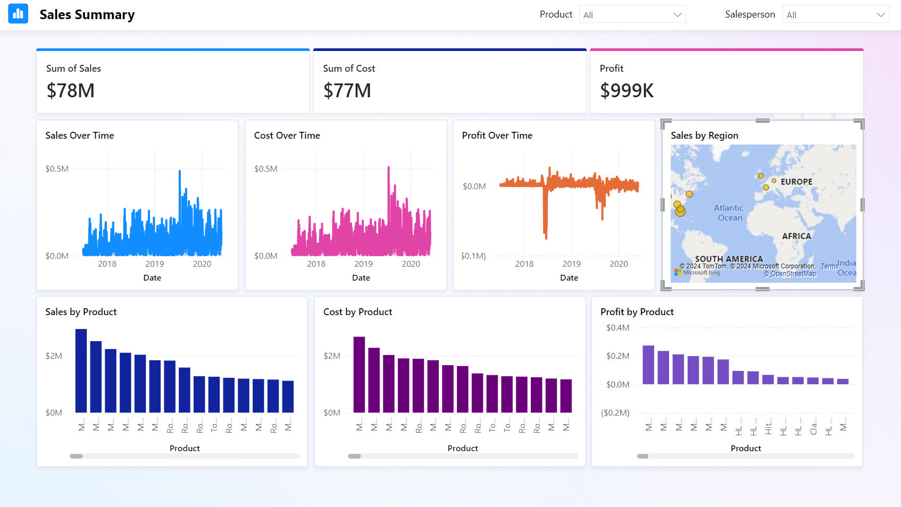
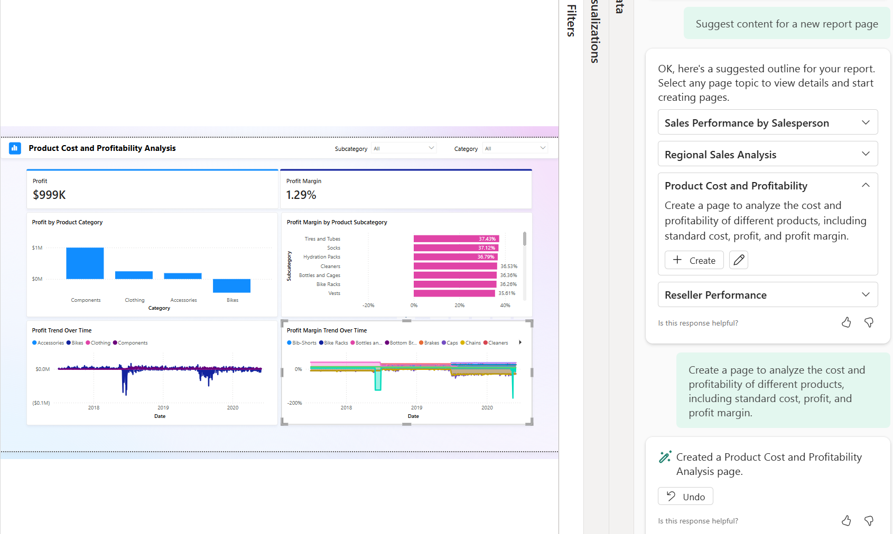
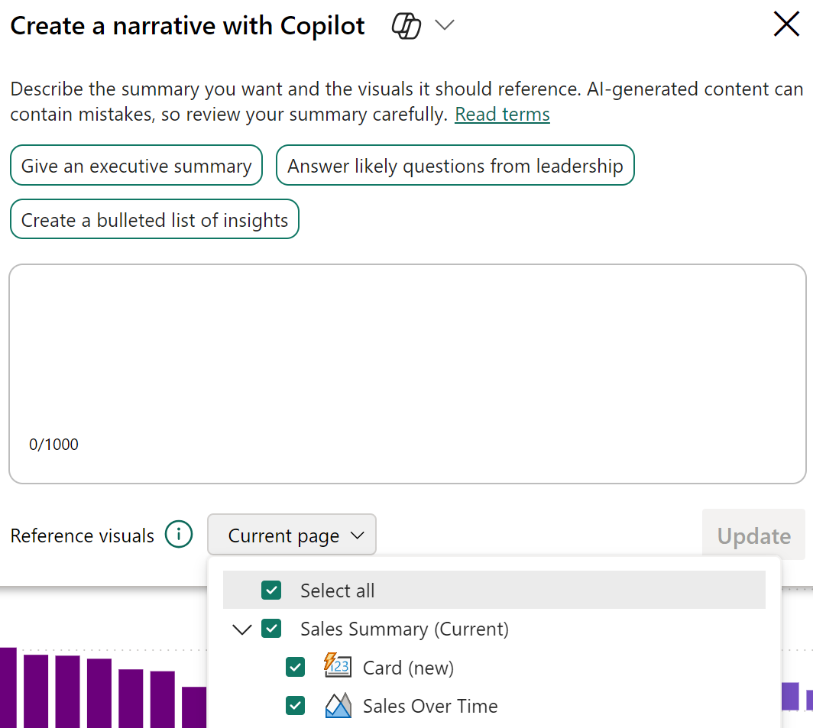
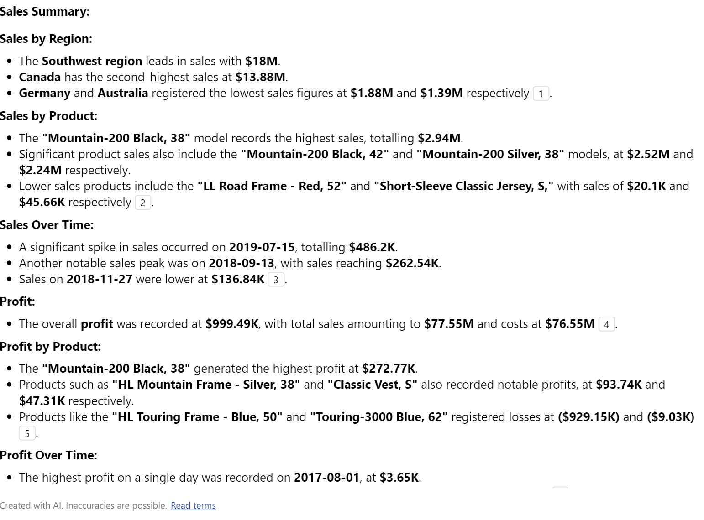
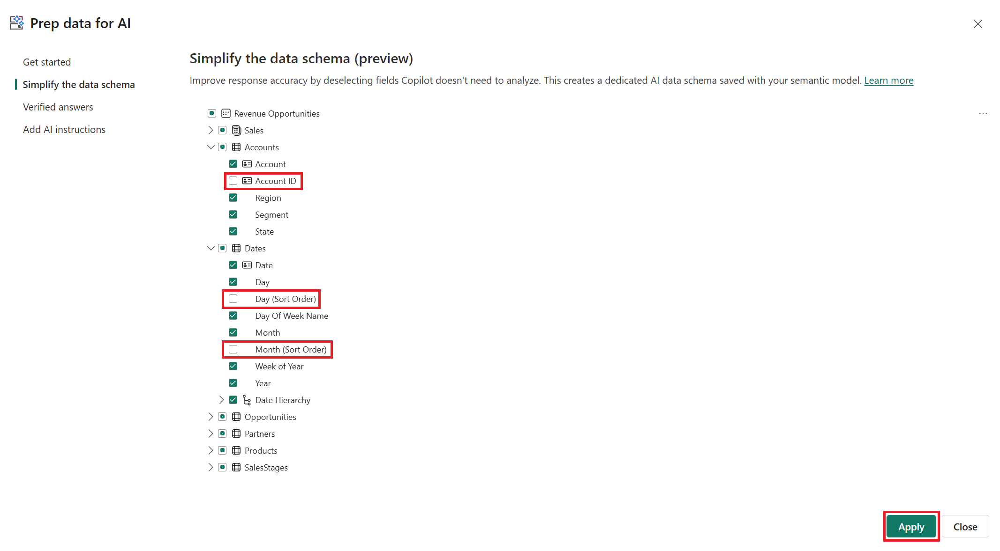
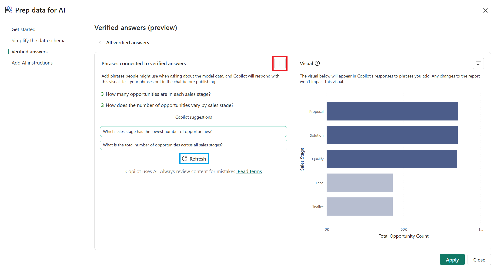
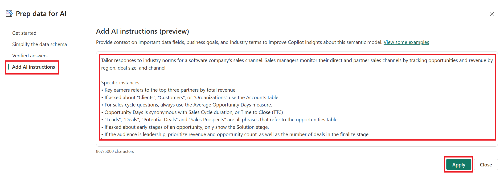
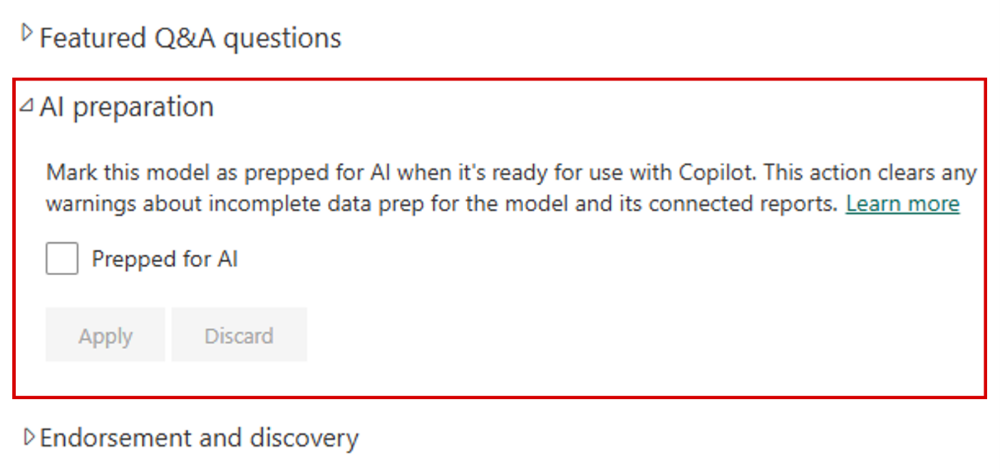
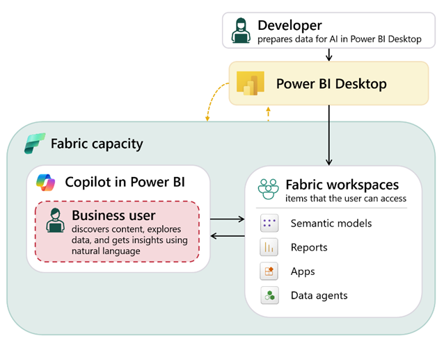
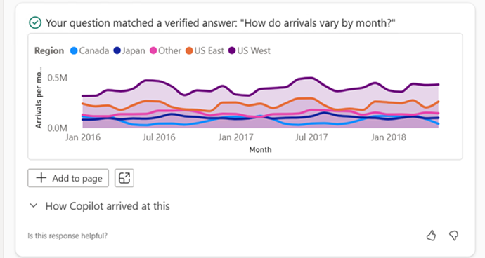

# Get Started with Microsoft Data Analytics

## Overview

Core components of Microsoft Data Analytics include:

- **Descriptive Analytics**: Descriptive analytics help answer questions about **what has happened** based on historical data. Descriptive analytics techniques summarize large semantic models to describe outcomes to stakeholders.

- **Diagnostic Analytics**: Diagnostic analytics help answer questions about **why something happened**. This involves techniques such as drill-down, data discovery, data mining, and correlations to identify patterns and relationships in the data.

- **Predictive Analytics**: Predictive analytics help answer questions about **what is likely to happen in the future**. This involves using statistical models and machine learning techniques to forecast future outcomes based on historical data.

- **Prescriptive Analytics**: Prescriptive analytics help answer questions about **what actions should be taken** to achieve desired outcomes. This involves using optimization and simulation techniques to recommend the best course of action based on predictive insights.

- **Artificial Intelligence (AI)**: AI involves the use of advanced algorithms and machine learning techniques to automate decision-making processes and enhance data analytics capabilities.

## Roles in Data Analytics

Several key roles are involved in the data analytics process:

- **Business Analysts**: Business analysts work closely with stakeholders to understand business needs and translate them into data requirements. They analyze data to provide insights that inform business decisions.

- **Data Analysts**: Data analysts are responsible for collecting, processing, and performing statistical analyses on large datasets. They create reports and visualizations to communicate findings to stakeholders. 
A data analyst is also responsible for the management of Power BI assets, including reports, dashboards, workspaces, and the underlying semantic models that are used in the reports. 

- **Data Engineers**: Data engineers design, build, and maintain the infrastructure needed for data storage and processing. They ensure that data is accessible, reliable, and secure for analysis.

- **Analytics Engineers**: Analytics engineers bridge the gap between data engineering and data analysis. They build and maintain data pipelines, transform raw data into usable formats, and create data models that support analytics efforts.

- **Data Scientists**: Data scientists use advanced statistical and machine learning techniques to analyze complex datasets. They develop predictive models and algorithms to extract insights and inform strategic decisions.

## Tasks of a Data Analyst

A data analyst typically performs the following tasks:

1. **Prepare**: Data preparation is the process of **profiling, cleaning, and transforming** your data to get it ready to model and visualize.
Data preparation is the process of taking raw data and turning it into information that is trusted and understandable.
Data preparation also involves understanding how you're going to get and connect to the data and the performance implications of the decisions. 
Privacy and security assurances are also important. 

2. **Model**: Data modeling is the process of determining how your tables are related to each other. This process is done by defining and creating relationships between the tables. From that point, you can enhance the model by **defining metrics and adding custom calculations** to enrich your data.
Creating an effective and proper semantic model is a critical step in helping organizations understand and gain valuable insights into the data. A poorly designed model can have a drastically negative impact on the general **accuracy and performance** of your report. 

3. **Visualize**: Data visualization is the process of **representing your data in a visual format**, such as charts, graphs, and maps. The reports that are created during the visualization task help businesses and decision makers understand what that data means so that accurate and vital decisions can be made.
A well-designed report should tell a compelling story about that data, which will enable business decision makers to quickly gain needed insights. 
The business might communicate that they need all data points on a given report to help them make decisions. As a data analyst, you should take the time to fully understand the problem that the business is trying to solve.

4. **Analyze**: The analyze task is the important step of understanding and interpreting the information that is displayed on the report.
Advanced analytics enables businesses and organizations to ultimately drive better decisions throughout the business and create **actionable insights and meaningful results**.

5. **Manage**: The manage task is the process of **deploying, sharing, and maintaining** your reports, dashboards, and datasets.
The management of your content helps to foster collaboration between teams and individuals. Sharing and discovery of your content is important for the right people to get the answers that they need. It is also important to help ensure that items are secure. You want to make sure that the right people have access and that you are not leaking data past the correct stakeholders.
For key business data, endorsing a semantic model as certified can help to ensure trust in that data.

# Get started building with [Power BI](https://www.microsoft.com/en-us/power-platform/products/power-bi)

## Use Power BI

There are three primary components to Power BI:

- Power BI Desktop (desktop application)
- Power BI service (online platform)
- Power BI Mobile (cross-platform mobile app)

### The Power BI workflow

The Power BI workflow consists of the following steps:

1. **Connect to data**: Connect to data with **Power BI Desktop**.
2. **Transform and clean data**: Transform data with **Power Query Editor** (comes with Power BI Desktop).
3. **Model data**: Model data with **Power BI Desktop**.
4. **Create visualizations**: Create visualizations and reports with **Power BI Desktop**.
5. **Publish and share**: Publish report to **Power BI service**.
6. **Distribute and manage**: Distribute and manage reports in the **Power BI service**.

## Building blocks of Power BI
The building blocks of Power BI are **semantic models** and **visualizations**. Create a semantic model and then use visuals to build a report. 

### Create a semantic model

A semantic model consists of all connected data, transformations, relationships, and calculations.

1. Connect to as many data sources as needed.
2. Transform and clean the data to ensure quality, using **Power Query Editor**.
3. Add relationships between tables and calculations to extend the semantic model.

After creating the semantic model, you can create visualizations in a report.

The building blocks of Power BI are **semantic models** and **visuals**. Using **Power BI Desktop**, you **create the semantic model and use visuals to create reports**.

In the **Power BI service**, you can **distribute content** to your consumers and **use reports to create dashboards**.

### Create visualizations in a report

In Power BI Desktop, when you create a visualization (also called **visual**), you add it to the **canvas** for a report page.
Choose your visualizations to build pages in your report. It's ideal to keep each page simple with related data, so consumers can easily see the insights.

One of the most valuable features of Power BI reports is the **interactivity** between visuals. Depending on your design, they can also drillthrough from one visual to more detail or filter based on different fields in the report.

Once you're satisfied with your report, you publish it to the **Power BI service**.


### Create a dashboard
In the **Power BI service**, you can also create **dashboards** after you've *published* a report.

Dashboards consist of a single page made up of **tiles**. Add tiles to a dashboard by *pinning a visual in a report* to the dashboard. *Tiles aren't interactive* like visuals, so when a user interacts with the tile, they go to the underlying report for more information.

## Tour and use the Power BI service

The Power BI service provides a simple and interactive user experience to take your data analytics to the next level.

### Organize items with workspaces

Workspaces are the foundation of the Power BI service. When publishing any report, you *must* choose a workspace. By default, every user has access to *My workspace*, which is ideal only for testing. When you want to share content with others, *always* create and use a shared workspace.


### Explore sample reports

Power BI offers several sample reports for you to explore. These reports load to My workspace so you can explore privately. You can access sample reports in the **Learn** section of the navigation pane.


### Distribute content

In a workspace, you can create an **app**, which provides consumers a simplified interface to access reports and dashboards.

In the app configuration, you set up the app, select the content to include (limited to the current workspace), and choose your audience.

Once you create an app, you **must** update the app *after each change to items* in the workspace. The requirement to update the app allows you to *control what version of the content* is visible to your audience.

Apps are the ideal sharing solution within any organization. While you can grant access to the workspace, workspace permissions may grant users access to more content than desired. Sharing individual items also presents a problem if you make changes you don't want consumers to see yet.


### Explore template apps

Template apps allow you to find an existing app that suits your needs and then you connect your data. These apps can be a great way to quickly share insights with minimal effort.


In the following screenshot, we've installed the GitHub template app and have expanded the report. We can see different report pages, including *Top 100 Contributors and Pull Requests*. If your organization is using GitHub, using this template app can easily support your needs without starting from the beginning.


### Refresh a semantic model

In order to support your ever-changing data, you can configure scheduled refreshes of your semantic models in the Power BI service. On-demand refreshes are also available.


# Introduction to [Microsoft Fabric](https://www.microsoft.com/en-us/microsoft-fabric)

Microsoft Fabric is an end-to-end, unified data and analytics platform that brings together various data services and tools into a single environment. Fabric provides a set of integrated services that enable you to ingest, store, process, and analyze data in a single environment.

Fabric includes the following services:

- Data engineering
- Data integration
- Data warehousing
- Real-time intelligence
- Data science
- Business intelligence

Additionally, Microsoft Fabric integrates Copilot.

## Explore end-to-end analytics with Microsoft Fabric

Scalable analytics can be complex, fragmented, and expensive. Microsoft Fabric simplifies analytics solutions by providing a single, easy-to-use product that integrates various tools and services into one platform. 
Fabric is a unified [*software-as-a-service (SaaS)*](https://azure.microsoft.com/en-us/resources/cloud-computing-dictionary/what-is-saas) platform where all data is stored in a single open format in **OneLake**. OneLake is accessible by all analytics engines in the platform, ensuring scalability, cost-effectiveness, and accessibility from anywhere with an internet connection.

### OneLake: Fabric's centralized data storage architecture

OneLake is Fabric's centralized data storage architecture that enables collaboration by eliminating the need to move or copy data between systems. OneLake unifies your data across regions and clouds into a single logical lake without moving or duplicating data.

**All** compute engines in Fabric **automatically store their data in OneLake**, making it directly accessible without the need for movement or duplication. For **tabular data**, the analytical engines in Fabric write data in **delta-parquet format** and all engines interact with the format seamlessly.

**Shortcuts** are references to *files* or *storage locations external* to OneLake, allowing you to access existing cloud data *without* copying it.

OneLake is built on [*Azure Data Lake Storage (ADLS)*](https://learn.microsoft.com/en-us/azure/storage/blobs/data-lake-storage-introduction) and supports various formats, including [Delta](https://delta.io/), [Parquet](https://parquet.apache.org/), [CSV](https://en.wikipedia.org/wiki/Comma-separated_values), and [JSON](https://www.json.org/json-en.html). 


### Workspaces

Workspaces serve as **logical containers** that help you organize and manage your data, reports, and other assets. Each workspace has its **own set of permissions**, ensuring that only authorized users can view or modify its contents. Workspaces allow you to manage compute resources and integrate with **Git** for version control.

### Administration and governance
Fabric's OneLake is **centrally governed** and **open** for collaboration. Data is secured and governed in **one place**, which allows users to easily find and access the data they need. Fabric administration is centralized in the **Admin portal**.
In the admin portal you can manage **groups** and **permissions**, configure **data sources** and **gateways**, and **monitor** usage and performance. You can also access the Fabric **admin APIs** and **SDKs** in the admin portal, which can *automate common tasks and integrate Fabric with other systems*.
The **OneLake catalog** helps you analyze, monitor, and maintain data governance. It provides guidance on sensitivity labels, item metadata, and data refresh status, offering insights into the governance status and actions for improvement.

## Explore data teams and Microsoft Fabric

Fabric increases collaboration between data professionals by **removing** *data silos* and *the need for multiple systems*.

### Traditional roles and challenges

In a traditional analytics development process, data teams often face several challenges due to the division of data tasks and workflows.

Data engineers process and curate data for analysts, who then use it to create business reports. This process requires extensive coordination, often leading to delays and misinterpretations.

Data analysts often need to perform downstream data transformations before creating Power BI reports. This process is time-consuming and can lack the necessary context, making it harder for analysts to connect directly with the data.

Data scientists face difficulties integrating native data science techniques with existing systems, which are often complex, and makes it challenging to efficiently provide data-driven insights.

### Evolution of collaborative workflows

Microsoft Fabric simplifies the analytics development process by unifying tools into a SaaS platform. Fabric allows different roles to collaborate effectively without duplicating efforts.

**Data engineers** can ingest, transform, and load data directly into **OneLake** using **Pipelines**, which automate workflows and support scheduling. They can store data in **lakehouses**, using the Delta-Parquet format for efficient storage and versioning. Notebooks provide advanced scripting capabilities for complex transformations.

**Analytics engineers** bridge the gap between data engineering and analysis by curating data assets in **lakehouses**, ensuring data quality, and enabling self-service analytics. They can create **semantic models in Power BI** to organize and present data effectively.

**Data analysts** can transform data upstream using **dataflows** and connect directly to **OneLake** with **Direct Lake mode**, reducing the need for downstream transformations. They can create interactive reports more efficiently using **Power BI**.

**Data scientists** can use integrated notebooks with support for Python and Spark to build and test machine learning models. They can store and access data in lakehouses and integrate with **Azure Machine Learning** to operationalize and deploy models.

**Low-to-no-code users and citizen developers** can discover curated datasets through the OneLake catalog and use **Power BI** templates to quickly create reports and dashboards. They can also use dataflows to perform simple ETL tasks without relying on data engineers.

## Enable and use Microsoft Fabric

Before you can explore the end-to-end capabilities of Microsoft Fabric, it must be enabled for your organization. You might need to work with your IT department to enable Fabric for your organization, including one of the following roles:

- **Fabric admin** (formerly Power BI admin): Manages Fabric settings and configurations.
- **Power Platform admin**: Oversees Power Platform services, including Fabric.
- **Microsoft 365 admin**: Manages organization-wide Microsoft services, including Fabric.

### Enable Microsoft Fabric

Admins can enable Fabric in the **Admin portal > Tenant settings** in the **Power BI service.** Fabric can be enabled for the entire organization or for specific Microsoft 365 or Microsoft Entra security groups. Admins can also delegate this ability to other users at the capacity level.


### Create workspaces

Workspaces are collaborative environments where you can create and manage items like *lakehouses*, *warehouses*, and *reports*. 

In Workspace settings, you can configure:

- **License type** to use Fabric features.
- **OneDrive** access for the workspace.
- **Azure Data Lake Gen2 Storage** connection.
- **Git** integration for version control.
- **Spark workload** settings for performance optimization.

You can manage workspace access through four roles: **admin, contributor, member, and viewer**. These roles apply to all items in a workspace and should be reserved for collaboration. For **more granular access control, use item-level permissions** based on business needs.

### Discover data with OneLake catalog

**The OneLake catalog** in Microsoft Fabric helps users easily **find and access various data sources** within their organization. Users **explore and connect to data sources**, ensuring they have the right data for their needs. Users **only** see items shared with them. 

Here are some considerations when using OneLake catalog:

- Narrow results by workspaces or domains (if implemented).
- Explore default categories to quickly locate relevant data.
- Filter by keyword or item type.


### Create items with Fabric workloads

Each workload in Fabric offers different item types for storing, processing, and analyzing data. Fabric workloads include:

- **Data Engineering**: Create lakehouses and operationalize workflows to build, transform, and share your data estate.
- **Data Factory**: Ingest, transform, and orchestrate data.
- **Data Science**: Detect trends, identify outliers, and predict values using machine learning.
- **Data Warehouse**: Combine multiple sources in a traditional warehouse for analytics.
- **Databases**: Create and manage databases with tools to insert, query, and extract data.
- **Industry Solutions**: Use out-of-the-box industry data solutions.
- **Real-Time Intelligence**: Process, monitor, and analyze streaming data.
- **Power BI**: Create reports and dashboards to make data-driven decisions.

Fabric integrates capabilities from existing Microsoft tools like **[Power BI](https://www.microsoft.com/en-us/power-platform/products/power-bi)**, **[Azure Synapse Analytics](https://azure.microsoft.com/en-us/products/synapse-analytics)**, and **[Azure Data Factory](https://azure.microsoft.com/en-us/products/data-factory)** into a unified platform. Fabric also supports a data mesh architecture, allowing decentralized data ownership while maintaining centralized governance. This design eliminates the need for direct Azure resource access, simplifying data workflows.

### Enhance productivity with Copilot in Fabric

[Microsoft Copilot in Fabric](https://learn.microsoft.com/en-us/fabric/fundamentals/copilot-fabric-overview) is a generative AI assistant that enhances productivity and accelerates insights across all Fabric workloads. [Copilot](https://copilot.microsoft.com/) uses [large language models (LLMs)](https://en.wikipedia.org/wiki/Large_language_model) to provide intelligent assistance for data professionals, self-service users, and business users.

#### Copilot capabilities across workloads

Copilot provides tailored assistance for each Fabric workload:

- **Data Engineering and Data Science**: Intelligent code completion, automated routine tasks, industry-standard code templates, and contextual code suggestions that adapt to specific tasks. Copilot helps with data preparation, pipeline building, and insight generation.

- **Data Factory**: AI-enhanced toolset supporting both citizen and professional data wranglers with intelligent code generation for data transformation and code explanations for complex tasks.

- **Data Warehouse and SQL Database**: Natural language to SQL conversion, code completion, quick actions, and intelligent insights. Users can describe what they want in plain language, and Copilot generates the appropriate SQL queries.

- **Power BI**: Automatic report generation, summary creation for report pages, synonym generation for better Q&A capabilities, and natural language querying of data. Business users can also use Copilot to extract more insights and chat with the report data.

- **Real-Time Intelligence**: Advanced AI tool that translates natural language questions into [Kusto Query Language (KQL)](https://learn.microsoft.com/en-us/kusto/query/?view=microsoft-fabric) queries, streamlining data analysis for both experienced users and citizen data scientists.

#### Enabling Copilot

Administrators must enable Copilot in the **Admin portal > Tenant settings** in the **Power BI service**.

Copilot helps users work more efficiently by providing AI assistance for common tasks like writing code, generating queries, and creating reports. This support is available to both technical and business users while maintaining organizational security policies.

# Get Started with Copilot in Power BI

## Use Copilot in Power BI to prepare and model data

### Prepare data in Power Query

- Profile: Assess column quality, distribution, and profile.
- Clean: Address missing values, correct out-of-range or inconsistent entries, and remove duplicates.
- Transform: Rename columns, set correct data types, and reshape tables as needed.

### Configure a semantic model

Relationships allow you to filter and summarize data in report visuals later in the development process. 

In the following image, there's a single fact table connected by relationships to dimension tables. Power BI reports work best when using a star or snowflake schema for the semantic model.

Copilot can summarize your semantic model and provide a high-level overview of the structure and key elements. This summary can help you understand important objects or missing relationships, for example.


### Query with DAX

There are four views in **Power BI Desktop:** **Report, Table, Model, and DAX Query**. In the **DAX Query view**, you can select **Copilot** in the **ribbon** and **use natural language** to describe what you want.

Consider the following prompt `total sales for all salespeople individually for all items in the accessories category` entered into the Copilot feature of DAX Query view.


This prompt is intending to calculate each individual salesperson's total sales for the accessories category. At **AdventureWorks**, there are multiple categories with multiple products within. Accessories have low sales, and the business requirement is to understand better who is selling more accessories, in case they can share valuable information.


```DAX

// DAX query generated by Fabric Copilot with "total sales for all salespeople individually for all items in the accessories category"
// Total sales for each salesperson for items in the accessories category
EVALUATE
  SUMMARIZECOLUMNS(
    'Salesperson'[Salesperson],
    FILTER('Product', 'Product'[Category] == "Accessories"),
    "Total Sales", [Total Sales]
  )
```

The following table shows sample results of the Copilot-generated DAX query.

| Salesperson | Total Sales |
|-------------|-------------|
| Stephen Jiang | 8374.76 |
| Michael Blythe | 38682.84 |
| Linda Mitchell | 66916.05 |

#### Create measures from DAX queries

Use **Copilot** in **DAX Query View** to explore the data and determine which measures you need to create, and then select **Update model** with changes to create the measures. The following query was generated from a `suggest measures` prompt.

```DAX
// DAX query generated by Fabric Copilot with "Suggest new measures in a DAX query for further analysis and try them out with one or more suitable columns"
DEFINE
  // New measure to calculate the average profit per product sold
  MEASURE 'Sales'[Avg Profit per Product] = DIVIDE([Profit], [Unique Products Sold])
  // New measure to calculate the average sales per reseller
  MEASURE 'Sales'[Avg Sales per Reseller] = DIVIDE([Total Sales], [Unique Resellers])
  // New measure to calculate the average quantity per order
  MEASURE 'Sales'[Avg Quantity per Order] = DIVIDE([Total Quantity], [Orders])
  // New measure to calculate the average sales per order
  MEASURE 'Sales'[Avg Sales per Order] = DIVIDE([Total Sales], [Orders])

// Evaluate the new measures
EVALUATE
  ROW(
    "Avg Profit per Product", [Avg Profit per Product],
    "Avg Sales per Reseller", [Avg Sales per Reseller],
    "Avg Quantity per Order", [Avg Quantity per Order],
    "Avg Sales per Order", [Avg Sales per Order]
  )
```

And here's the resulting table:

|Avg Profit per Product |	Avg Sales per Reseller	|Avg Quantity per Order	|Avg Sales per Order|
|---|---|---|---|
|2992.4987|	122703.4339	|56.44745575221239	|21445.9541|

The following screenshot is the result of three simple steps:

- Enter the suggest measures prompt.
- Select Keep query after results return.
- Run the query.

As a developer, you can **Update model** with changes to create the measures best suited to your project.


## Create reports with Copilot in Power BI

### Create reports with Copilot in Power BI

Copilot in Power BI helps you build interactive reports faster by turning your ideas into report elements with just **a prompt**. You can use **suggested prompts** or enter **your own** to **create new report pages, suggest content, or answer specific data questions** in the **Copilot pane**.


The following example was generated by using the **Create a new report page suggested prompt**. Copilot asked for the name and description, and then created the report elements, including:

- Header with slicers for product and salesperson.
- Card visuals for the sums of sales, cost, and measure for profit (sales minus cost).
- Area charts evaluating sales, cost, and profit over time.
- Column charts evaluating sales, cost, and profit by product.
- A Map visual for sales by region.



### Create reports in the Power BI service

When you create reports in Power BI Desktop and publish them, both the **semantic model** and **the report** are saved in your **workspace**. The semantic model contains your data, relationships, and measures, while the report is the visual layer you design.

Copilot can also help create reports based on semantic models in the Power BI service. To get started, **select the ellipsis (...)** next to your semantic model and choose **Create report**.


For this example report, we see several different possibilities offered, including:

- Sales Performance by Salesperson
- Regional Sales Analysis
- Product Cost and Profitability

In the following screenshot, we selected the **Product Cost** **and** **Profitability** prompt to generate a new report page. This page has a similar layout from the one created with Power BI Desktop. There are **Card visuals**, **Bar and Column charts**, and **Area charts** to help analyze the cost and profitability of different products, including standard cost, profit, and profit margin.



#### Create pages with custom prompts

You can also provide your own prompt based on your knowledge of the data and business requirements for the report. There might be limitations to what Copilot can create based on your prompt. Some ideas for our model are:

- Create a page that shows the top 10 products by sales.
- Create a visual on a new page that shows the top three colors across all products sold.

### Summarize report insights with Copilot

Copilot can also help you communicate key findings by **generating narrative summaries of your report data**. Whether you’re preparing an executive summary or answering likely questions from leadership, Copilot’s summaries help keep your audience engaged and informed. Use the **Narrative visual** or **Copilot pane** to create **summaries with suggested or custom prompts**, referencing all visuals on a page or only selected ones.

- Example prompts:
    - Give an executive summary
    - Answer likely questions from leadership
    - Create a bulleted list of insights



In the following screenshot, the Copilot-generated summary, some of the highlighted points are:

- Highest and lowest sales across products.
- A significant spike in sales.
- Overall profit and highest profit on a single day.



#### Summarize in the Copilot pane

Both **developers** and **consumers** can use the Copilot pane to summarize or answer questions about the report. Copilot considers all data, including data hidden behind filters or slicers that aren't currently applied. You can **specify the scope (entire report or current page)** in your prompt.

## Get your data ready for AI usage in Power BI

Copilot **streamlines** the development process of **preparing semantic models**, **building reports**, and **exploring data** through natural language. 

### Prepare your semantic model

Once you create your semantic model and report, you can use the **Prep data for AI features** to further curate the business user's experience. These features are available in the **Prep data for AI dialog box**.

**Simplify the data schema** by removing unnecessary tables and columns, and using clear, descriptive names. 



**Verified answers** associate common business questions with specific visuals. 



**Provide AI instructions** with key business context and domain-specific logic to Copilot to help tailor responses. AI instructions help clarify business terms, guide analysis approaches, and provide critical data context. Once saved, these instructions are used by Copilot to respond more intelligently to user prompts. 



### Test and mark the model

It's important to test your model to validate that **you get expected results** before marking the model as reviewed. Once you're confident that your schema is simplified, your verified answers are configured, and your AI instructions are updated, you can mark the semantic model as **Prepped for AI**. You can configure this property for the semantic model in the **Power BI service**.



### Integration with Microsoft Fabric

Power BI is part of the Microsoft Fabric analytics platform. Copilot in Power BI and Fabric data agents both use AI, but have different purposes. This module doesn't go into detail for Fabric data agents, but provides a link in the summary for further learning.

- **Copilot in Power BI** is preconfigured to assist you with certain tasks, such as data cleaning to increase productivity.
- **Fabric data agents** can be customized to include specific data and follow instructions for additional context.



### Chat with your data

Now that your data is prepared, business users can use Copilot’s chat feature to explore and understand data.


In Power BI service, users simply select Copilot to chat with the data, such as:

- **Ask questions:** Use everyday language to query your data, such as "What were our top sales regions last quarter?"
- **Interpret answers:** Copilot provides responses with supporting visuals and explanations of how it arrived at the answer.
- **Summarize findings:** Quickly generate summaries to share insights with others or inform decision-making.

